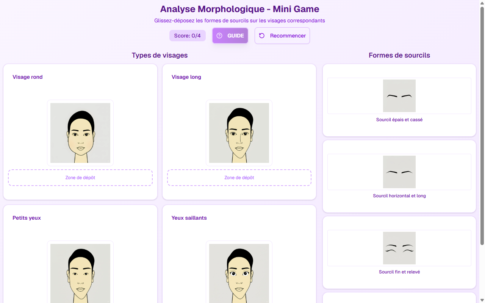

# Jeu Morphologie — Microblading & Microblading EN Slide 8

**Course:** MICROBLADING & MICROBLADING (EN)  
**Slide:** 8  
**Live URL:** https://v0-face-shape-game.edtechiecorp.com  
**Stack:** Next.js · Tailwind CSS · TypeScript · GitHub Pages  

## What this slide does

An interactive drag-and-drop game where learners match eyebrow shapes to face types — round, long, square, oval, and heart-shaped. Trains the morphological analysis skills required before performing microblading, where selecting the correct brow arch and tail length for each face shape is a core professional competency. The game format makes this analytical skill engaging to learn and easy to remember.

## Screenshot

## Usage

This slide is embedded as an iframe inside Coassemble at the live URL above. DNS is managed via Cloudflare (`edtechiecorp.com`). To update the slide, push to the `main` branch — GitHub Actions will rebuild and redeploy automatically.
